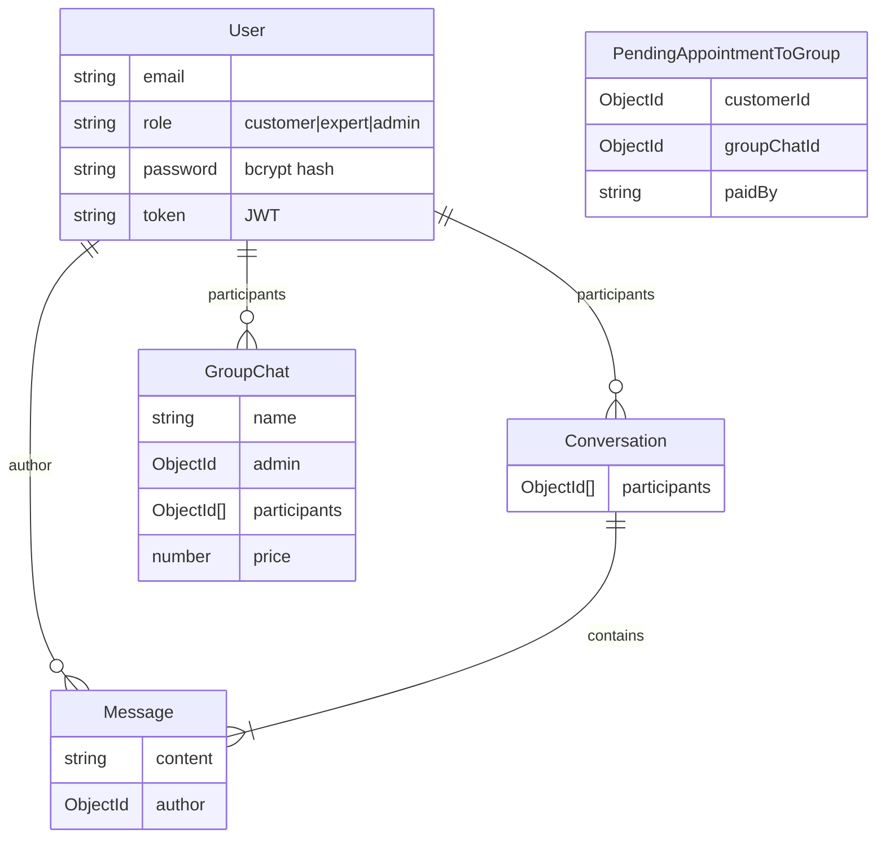

# WisdomLinked/Chat Codebase Overview

> [!IMPORTANT]
> This document provides a "brain dump" of the internal workings of the `WisdomLinked/chat` project, updated after a deep-dive audit of the `develop` branch.

## 1. High-Level Architecture

The project is a **MERN Stack** application (MongoDB, Express, React, Node.js) with real-time capabilities via **Socket.io** and **WebRTC**.

```mermaid
graph TD
    User[User (Browser)]
    
    subgraph Frontend [React Client (FE)]
        UI[Material UI Components]
        Redux[Redux State Manager]
        SocketClient[Socket.io Client]
        WebRTC[Simple-Peer / WebRTC]
    end
    
    subgraph Backend [Node/Express Server (BE)]
        API[REST API Routes]
        SocketServer[Socket.io Server]
        Auth[JWT Auth Middleware]
        Controllers[Business Logic]
    end
    
    subgraph Infrastructure
        MongoDB[(MongoDB Database)]
        Stripe[Stripe Payments]
        Email[SendGrid]
        DOFaaS[DigitalOcean Functions (Images)]
        DOSpaces[DigitalOcean Spaces (Files)]
    end

    User -->|Interacts| UI
    UI -->|Dispatches| Redux
    UI -->|HTTP Requests| API
    SocketClient <-->|Real-time Events| SocketServer
    WebRTC <-->|P2P Video/Audio| User
    
    API --> Auth
    Auth --> Controllers
    Controllers --> MongoDB
    Controllers --> Stripe
    Controllers --> Email
    Controllers --> DOFaaS
```

## 1.1 Key Features (Recent Updates)
*   **Real-time Communication**: 1:1 Video Calls (WebRTC), Group Video Seminars, and Text Chat.
*   **Community Channels**: Open group chats for broader engagement (`type: 'community'`).
*   **AI ChatBot**: An automated Q&A system (`ChatBotQA`) using text search to answer user queries.
*   **Role-Based Access**: Specialized flows for Experts (Service Providers), Customers, and Admins.

---

## 2. Directory Structure & Tech Stack

### Backend (`/BE`)
- **Technology**: Node.js, Express.js
- **Database**: MongoDB (via Mongoose)
- **Real-time**: `socket.io` for signaling and chat.
- **Key Folders**:
    - `models/`: Mongoose Schemas (Database definition).
    - `controllers/`: Business logic.
    - `routes/`: API endpoint definitions.
    - `socket/`: Socket event handlers.
    - `middlewares/`: Auth validation (`requireAuth.js`).

### Frontend (`/FE`)
- **Technology**: React (Create React App / `react-scripts`), TypeScript.
- **State**: Redux Toolkit.
- **Styling**: Material UI & TailwindCSS.
- **Key Folders**:
    - `src/pages/`: Main views (Login, Dashboards).
    - `src/components/`: Reusable UI blocks.
    - `src/store/`: Redux configuration.
    - `src/socket/`: WebRTC and Socket logic.

---

## 3. Core Data Models (Database Schema)

We reversed-engineered the schema from `BE/models`. Here are the critical relationships:



- **User**: The central entity. Handles both "Experts" and "Customers" via the `role` field.
- **GroupChat**: Represents paid seminars or group discussions. managed by an Admin (Expert).
- **PendingAppointmentToGroup**: Handles the flow of a customer paying to join a group/seminar.

---

## 4. Key Workflows explained

### 4.1 Authentication Flow ("How it breathes")
1.  **Register**:
    -   Frontend sends POST to `/api/auth/register`.
    -   Backend creates a `PendingUser` and sends a confirmation email (via Nodemailer) with a code.
    -   User clicks link -> POST `/api/auth/verifyRegistration` -> Moves data from `PendingUser` to `User`.
2.  **Login**:
    -   User enters credentials -> POST `/api/auth/login`.
    -   Backend verifies password (bcrypt).
    -   Backend creates a `PendingLogin` entry and emails a 6-digit OTP code (`123456` hardcoded in some places for dev?).
    -   User enters code -> POST `/api/auth/confirmLoginByCode`.
    -   Backend issues **JWT Token** (stored in Cookie/Response).

### 4.2 Real-Time Chat & Video
-   **Socket Connection**: On login, FE connects to socket server (`socketServer.js`).
-   **Direct Messages**:
    -   Events: `direct-message`, `direct-chat-history`.
    -   Server stores message in MongoDB `Message` model and relays to recipient via Socket ID.
-   **Video Calls (WebRTC)**:
    -   Events: `call-request`, `call-response`.
    -   The server acts as a **Signaling Server**, passing SDP (Session Description Protocol) data between peers.
    -   Actual media flows Client-to-Client (Mesh network) via `simple-peer`.

---

## 5. API Catalog (Summary)

| Prefix | Role | Key Endpoints |
| :--- | :--- | :--- |
| `/api/auth` | Authentication | `/login`, `/register`, `/verifyRegistration` |
| `/api/group-chat` | Seminars | `/` (create), `/add` (add member), `/delete` |
| `/api/expert` | Expert Tools | Manage timeslots, prices (inferred) |
| `/api/customer` | User Tools | Bookings etc. |
| `/api/admin` | System Admin | System-wide management |

## 6. Infrastructure & Deployment
-   **Environment Variables**: Heavy reliance on `.env` files (Mongo URI, Stripe Keys, Email Creds).
-   **Deployment**:
    -   Currently configured for manual start (`npm start`).
    -   No `Dockerfile` present (Recommendation: Add one for containerization).
    -   No CI/CD pipeline found (Recommendation: Add GitHub Actions).

## 7. Critical "Gotchas"
> [!WARNING]
> **Hardcoded Values**: Inspect `auth.controller.js`. The OTP code might be hardcoded to `"123456"` in some logic blocks (checking lines ~272, ~365). This is dangerous for production.

> [!NOTE]
> **Monorepo**: The project mixes Backend and Frontend in one repo. Ensure you run `npm install` in **BOTH** `BE/` and `FE/` directories separately.
