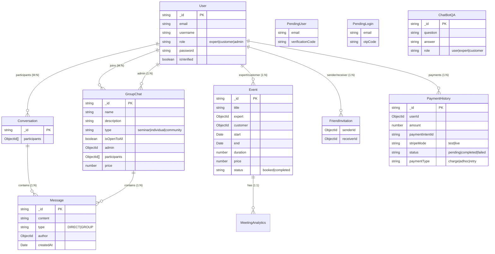

# Technical Diagrams

## 0. Visual Database Schema
> [!NOTE]
> Please open `VISUAL_DIAGRAMS.html` in the browser


## 1. System Architecture Diagram

```mermaid
graph TD
    subgraph Client [Frontend (React + Redux)]
        UI[User Interface]
        Redux[Redux Store]
        SocketClient[Socket.io Client]
        WebRTC[WebRTC Peer]
    end

    subgraph Server [Backend (Node.js + Express)]
        API[REST API Handlers]
        SocketServer[Socket.io Server]
        Auth[Auth Middleware]
        ChatBot[ChatBot Controller]
    end

    subgraph Database [Storage]
        MongoDB[(MongoDB)]
    end

    subgraph External [External Services]
        Stripe[Stripe Payments]
        Email[Nodemailer/SMTP]
        AWS[AWS S3 Images]
    end

    UI --> Redux
    Redux --> SocketClient
    SocketClient -- "WebSocket Events" --> SocketServer
    UI -- "REST Requests" --> API
    API --> Auth
    Auth --> MongoDB
    SocketServer --> MongoDB
    API --> ChatBot
    ChatBot --> MongoDB
    API --> Stripe
    API --> Email
    WebRTC -. "P2P Stream" .- WebRTC
    SocketClient -. "Signaling" .- SocketServer
```

## 2. Database Schema (Detailed ERD)


